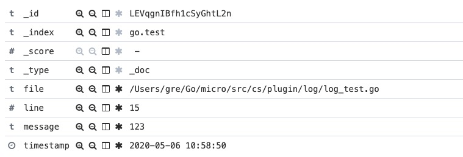

# cs
文件存储系统

基于 go-micro 构建文件存储系统，帮助学习者了解微服务以及常用组件。
- etcd
- docker
- redis
- mysql
- gin
- grpc
## 基础框架搭建

## 文件上传
1. 简单上传代码
2. 前端分片上传,服务端分片存储

## 用户管理
1. 账号注册登录
2. 鉴权管理
//TODO 角色权限

## 配置中心
etcd配置中心

## 日志持久化

> cs/plugin/log

elastic数据存储中心，kibana数据查看面板



## 熔断、降级、容错与健康检查

## 链路追踪

## 容器化

## How To Start

You must have etcd node and then execute the following command to add the App configuration

```shell
etcdctl put /cs/app/config/go.micro.cs.service.auth "{\"name\":\"go.micro.cs.service.auth\",\"address\":\"localhost:12004\",\"version\":\"latest\"}"
```

Start after

```shell
go run main.go --registry=etcd --registry_address=127.0.0.1:2379 --cc=127.0.0.1:2379
```

If the startup fails, please check whether the configuration files of redis and mysql are correct

1. Add a mysql configuration file

   ```shell
   etcdctl put /cs/app/config/mysql "{\"user\":\"root\",\"password\":\"root\",\"address\":\"localhost:3306\",\"db_name\":\"cs\",\"logMode\":true}"
   ```

2. Add a redis configuration file

   ```shell
   etcdctl put /cs/app/config/redis "{\"user\":\"root\",\"password\":\"root\",\"address\":\"localhost:6379\"}"
   ```

